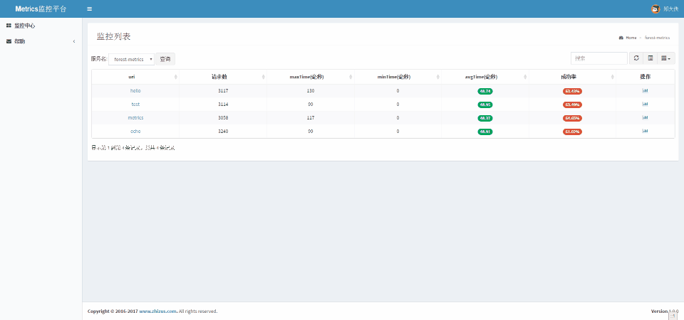
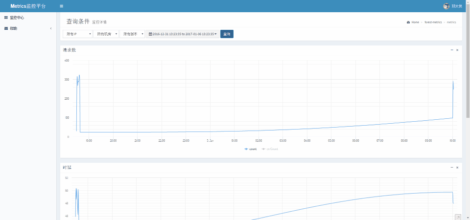

# forest-metric
基于语义级别具备故障发现和定位能力的业务模调轻量监控系统。
1、语义级别：由业务上报决定成功与否
2、模调：只反应主被调之间的质量,非全路径
3、故障发现：展示和告警
4、定位能力：具备多聚合维度逐层往下界定故障范围的功能
5、业务：适合业务逻辑相关的场景


## 名词解释
- 1、`主题`：代表一种统计数据，页面表现为一个独立的图表，
                例如成功率、延时、发送数、队列长度等
- 2、`指标`：可以是一个API/Appid或者其他，表示xx的请求数，xx的成功率
- 3、`维度`：数据聚合的粒度，目前支持指标/版本/isp/idc/host

## 模块
### metrics-client
数据上报的的client
  
 1. pom依赖：

``` xml
<dependency>
    <groupId>com.zhizus</groupId>
    <artifactId>metrics-client</artifactId>
    <version>0.0.1</version>
</dependency>
```

2.上报示例代码：

``` java
Metrics metrics = Metrics.startWithUri(uri);//uri 监控的业务标识
  // 监控业务代码
  ...
  metrics.success();// or metrics.failed();
```

### metrics-server
基于thrift协议和mongo的存储的metric server端

  1.pom依赖：

``` xml
<dependency>
    <groupId>com.zhizus</groupId>
    <artifactId>metrics-server</artifactId>
    <version>0.0.1</version>
</dependency>
```
2示例代码

``` java
public class MetricServer extends AbstractThriftServer {

    private MetricsIface iface;

    public MetricServer() {
        iface = new MetricsIface();
    }

    @Override
    public int getPort() {
        return 6666;
    }

    @Override
    public TProcessor getProcessor() {
        return new MetricService.Processor(iface);
    }

    public static void main(String[] args) {
        new MetricServer().start();
    }
}
```

### metrics-web
监控展示web项目



